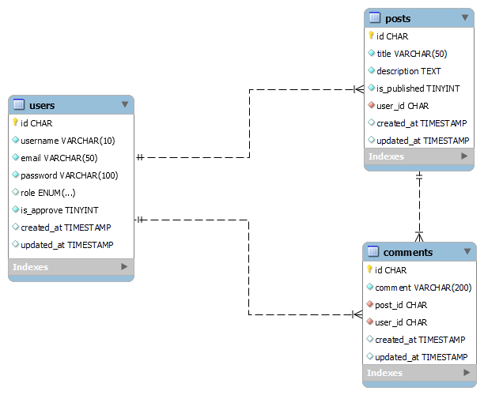

# Online Test Asia Ecommerce
    Aplikasi sederhana dengan Laravel dan MySQL serta dokumentasi API yang dapat diakses pada link di bawah. Penerapan JWT Auth, Resource Output serta Middleware untuk penerapan multi user (Admin, User, Guest) pada 3 data source (Users, Posts, Comments).

## Installation

### 1. Composer
```
composer install
```

### 2. Generate JWT Secret
```
php artisan jwt:secret
```

### 3. Migrate and Seeder
```
php artisan migrate
```

```
php artisan db:seed
```

## API Documentation
https://documenter.getpostman.com/view/16500692/Uz5GobTj

## ERD



